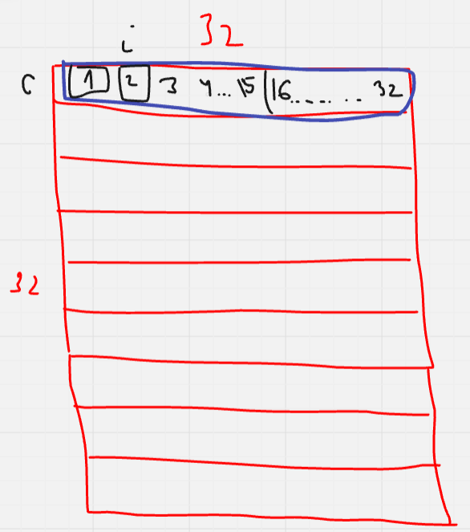

# ДЗ 2

## Задание 2.1
**Ответ**: для сигнала `y1` это будет сделать проще и эффективнее.

- Для подсчета `y1` нет зависимости по данным от соседних значений сигнала (то, что у нас есть обращения к соседним значениям сигнала `x` не страшно, так как мы не пишем в `x`). 
- Для подсчета `y2` есть зависимоть от 2-ух предыдущих элементов, что требует последовательного вычисления очередных значений сигнала, что плохо подходит для вычисления на GPU.

## Задание 2.2
**Ответ**: нет, так как в пределах одного варпа `idx` один и тот же.

Пусть синим цветом нарисован варп, а красным вся ворк-группа. Тогда, при указанном наложении SM'а на рабочую группу, варпы будут иметь один и тот же результат для `get_local_id(1)`, то есть это будет константа `c`.

Тогда для `i`-ого потока значение `idx = c + 32 * i`, где `get_local_size(1) == 32`. То есть `idx % 32 == c`, а `c` это константа в пределах одного варпа (имеется в виду, что когда варп отработал свой участок задачи, то `c`, конечно сменит свое значение, но каждый поток в варпе будет видеть одно и то же значение `c`).

    

Тогда code-divergence не будет.

## Задание 2.3

### Подзадача (а) 

- Coalesed: да, так как формула будет нам возвращать просто соседние индексы для соседних потоков.
- Кол-во записанных кэш-линий: `1` в рамках варпа, так как всего записываем последовательно `warp_size * sizeof(float) = 32 * 4 = 128` байт, как раз в одну кэш-линию умещается. Тогда на ворк-группе их будет `1 * 32`.

### Подзадача (b)

- Coalesed: нет, так как каждый поток с индексом `i` пойдет писать в ячейку с индексом `c + 32 * i`, где `c` это номер строчки в ворк-группе, до которой дошел варп и у всех потоков этот `c` равен одному и тому же. То есть мы делаем записи с прыжком в 32 флота, то есть в одну кэш-линию вмещается по 1 записи. 
- Кол-во записанных кэш-линий: `32` в рамках варпа, а всего `32 * 32 = 1024`.

### Подзадача (c)

- Coalesed: да, так как мы все еще делаем записи подряд, хотя и со сдвигом в 1 байт.
- Кол-во записанных кэш-линий: `2` в рамках варпа, так как мы на 1 байт сдвинулись, а линейки кэша требуют выравнивание. Тогда всего линеек `2 * 32 = 64`.